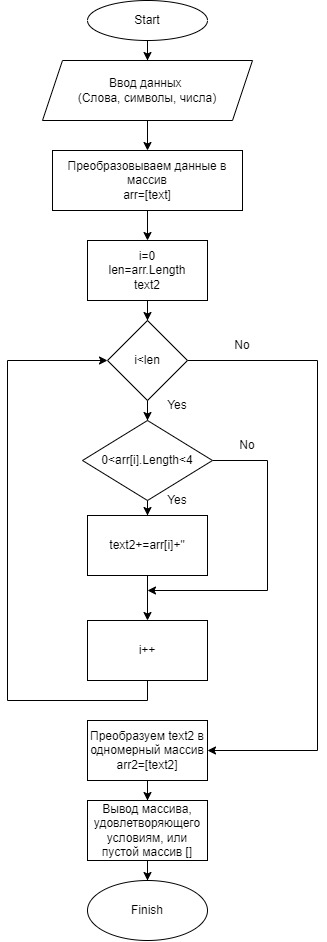

# Итоговая работа

## Задача:
 Написать программу, которая из имеющегося массива строк формирует новый массив из строк, длина которых меньше, либо равна 3 символам. Первоначальный массив можно ввести с клавиатуры, либо задать на старте выполнения алгоритма. При решении не рекомендуется пользоваться коллекциями, лучше обойтись исключительно массивами.

## Решение задачи:
- Запускаем программу
- Пользователю поступает предложение ввести данные (в виде текста, чисел или набора символов).
- Пользователь вводит данные, которые будут преобразованы в исходный массив.
- Программа получает текст, который ввел пользователь. Формирует из него одномерный массив, каждый элемент которого является частью введенного пользователем текста.
- С помощью метода *ThreeSymbol*  формируется новый массив, длина элементов которого больше 0 и меньше 4 символов.
- С помощью метода *ThreeSymbol*  формируется новый массив:
  - создается новая переменная *"text"* типа string
   - поочередно проверяется длина каждого элемента исходного массива
  - элементы исходного массива, длина которых больше 0 и меньше 4 символов добавляются в *"text"*, в качестве разделителя выбран пробел
  - проверены все элементы исходного массива, сформирована текстовая строка, в которой убирается лишний пробел в конце
  - формируем новый одномерный массив из значения переменной *"text"*
- С помощью метода *PrintArray* выводим в консоль оба массива: исходный и новый

### Блок-схема решения задачи:

